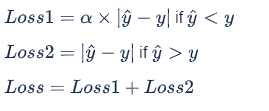

# Google-Smartphone-Decimeter-Challenge 竞赛方案回顾


​	该比赛是kaggle开放的关于提高智能手机定位精确度的比赛，属于时序竞赛类别，作者在竞赛中拿到一枚银牌 (rank: 45/810, id: dongchuanlumoyu)，这也是对我在日后继续努力的一种激励，我把自己在竞赛中的方案开源出来和大家分享，希望能找到更多志同道合的朋友一起交流，共同进步。


## 竞赛方案展示（Competition plan show）

### 一. 竞赛数据分析

比赛的目的是给从所给的训练集中预测各个时间戳下移动设备的分米级经纬度定位，数据类型包括：

* 索引类：

  collectionName 哪一次出行
  phoneName 设备名称
  phone 以上两项的合并
  millisSinceGpsEpoch 时间戳

* 基于原始传感数据设备推算的baseline:

  latDeg 经度
  lngDeg 纬度
  heightAboveWgs84EllipsoidM 高度

* *_derived.csv:

  millisSinceGpsEpoch 时间
  xSatPosM,ySatPosM,zSatPosM 卫星位置
  xSatVelMps,ySatVelMps,zSatVelMps 卫星速度
  satClkDriftMps 卫星时钟每秒几米飘移
  correctedPrM 修正的卫星到手机的距离(伪距) = rawPrM + satClkBiasM - isrbM - ionoDelayM - tropoDelayM
  signalType 信号类型(卫星类型 + 频段)
  svid 卫星id

  信号类型 + id的所有组合：

  ```
  'BDS_B1I_11', 'BDS_B1I_12', 'BDS_B1I_13', 'BDS_B1I_14', 'BDS_B1I_16', 'BDS_B1I_19', 'BDS_B1I_20',
  'BDS_B1I_21', 'BDS_B1I_22', 'BDS_B1I_23', 'BDS_B1I_24', 'BDS_B1I_25', 'BDS_B1I_26', 'BDS_B1I_27',
  'BDS_B1I_28', 'BDS_B1I_29', 'BDS_B1I_30', 'BDS_B1I_32', 'BDS_B1I_33', 'BDS_B1I_34', 'BDS_B1I_35',
  'BDS_B1I_36', 'BDS_B1I_37', 'BDS_B1I_6', 'BDS_B1I_7', 'BDS_B1I_8', 'GAL_E1_1', 'GAL_E1_11', 'GAL_E1_12',
  'GAL_E1_13', 'GAL_E1_15', 'GAL_E1_19', 'GAL_E1_2', 'GAL_E1_21', 'GAL_E1_24', 'GAL_E1_25', 'GAL_E1_26',
  'GAL_E1_27', 'GAL_E1_3', 'GAL_E1_30', 'GAL_E1_31', 'GAL_E1_33', 'GAL_E1_36', 'GAL_E1_4', 'GAL_E1_5',
  'GAL_E1_7', 'GAL_E1_8', 'GAL_E1_9', 'GAL_E5A_1', 'GAL_E5A_11', 'GAL_E5A_12', 'GAL_E5A_13', 'GAL_E5A_15',
  'GAL_E5A_19', 'GAL_E5A_2', 'GAL_E5A_21', 'GAL_E5A_24', 'GAL_E5A_25', 'GAL_E5A_26', 'GAL_E5A_27',
  'GAL_E5A_3', 'GAL_E5A_30', 'GAL_E5A_31', 'GAL_E5A_33', 'GAL_E5A_36', 'GAL_E5A_4', 'GAL_E5A_5', 'GAL_E5A_7',
  'GAL_E5A_8', 'GAL_E5A_9', 'GLO_G1_1', 'GLO_G1_10', 'GLO_G1_11', 'GLO_G1_12', 'GLO_G1_13', 'GLO_G1_14',
  'GLO_G1_15', 'GLO_G1_16', 'GLO_G1_17', 'GLO_G1_18', 'GLO_G1_19', 'GLO_G1_2', 'GLO_G1_20', 'GLO_G1_21',
  'GLO_G1_22', 'GLO_G1_23', 'GLO_G1_24', 'GLO_G1_3', 'GLO_G1_4', 'GLO_G1_5', 'GLO_G1_6', 'GLO_G1_7',
  'GLO_G1_8', 'GLO_G1_9', 'GPS_L1_1', 'GPS_L1_10', 'GPS_L1_11', 'GPS_L1_12', 'GPS_L1_13', 'GPS_L1_14',
  'GPS_L1_15', 'GPS_L1_16', 'GPS_L1_17', 'GPS_L1_18', 'GPS_L1_19', 'GPS_L1_2', 'GPS_L1_20', 'GPS_L1_21',
  'GPS_L1_22', 'GPS_L1_24', 'GPS_L1_25', 'GPS_L1_26', 'GPS_L1_27', 'GPS_L1_28', 'GPS_L1_29', 'GPS_L1_3',
  'GPS_L1_30', 'GPS_L1_31', 'GPS_L1_32', 'GPS_L1_4', 'GPS_L1_5', 'GPS_L1_6', 'GPS_L1_7', 'GPS_L1_8',
  'GPS_L1_9', 'GPS_L5_1', 'GPS_L5_10', 'GPS_L5_14', 'GPS_L5_18', 'GPS_L5_24', 'GPS_L5_25', 'GPS_L5_26',
  'GPS_L5_27', 'GPS_L5_3', 'GPS_L5_30', 'GPS_L5_32', 'GPS_L5_4', 'GPS_L5_6', 'GPS_L5_8', 'GPS_L5_9',
  'QZS_J1_1', 'QZS_J1_2', 'QZS_J5_1', 'QZS_J5_2 '
  ```

* _GnssLog.csv:
  - Raw
    millisSinceGpsEpoch = round( ( Raw::TimeNanos - Raw::FullBiasNanos ) / 1000000.0 )
    utcTimeMillis，可以跟上面的millisSinceGpsEpoch对应起来，方便传感器数据的处理
    Cn0DbHz 卫星天线的载噪比密度
    BiasUncertaintyNanos 以纳秒为单位的时钟偏差不确性
  - Sensor
    UncalAccel[X/Y/Z]
    UncalGyro[X/Y/Z]
    UncalMag[X/Y/Z]
  - Status 很多数据和Raw、derived的重合

* ground truth :

  latDeg_truth
  lngDeg_truth
  heightAboveWgs84EllipsoidM_truth
  hDop 水平座标精度因子 其实也可以作为评判样本是否可靠的 label
  vDop 垂直坐标精度因子
  speedMps 以米每秒为单位的地面速度
  courseDegree 相对于地面正北方向的顺时针方向（以度为单位）


## 二、特征工程

因为目的是预测数据中的baseline与ground的可能的差异程度，
选取的特征多是与差距、噪声、不确定性、增减量有关的

1. 时间周期性特征：
   计算日期在当年的什么位置 ((mon−1)×30+day)/365
2. 手机的类别特征
   共有7种手机，构建one hot
3. 相邻帧baseline特征
   - 相邻窗口(1 - 5)baseline平均值 与 当前帧baseline的差(的绝对值)
   - 相对于前\后一帧的baseline增量，如果没有前一帧就用后一帧
   - 前后帧差值的绝对值的平均
   - 加入前后帧的haversine距离作为特征(还没加)
4. derived
   - 计算 correctedPrm
   - 由于同一时间有好多条卫星数据，需要按时间合并，最后整合了 correctedPrm(修正的卫星到手机的距离)、rawPrUncM(原始伪距不确定性)、satClkDriftMps(卫星时钟以米/秒为单位漂移) 的均值和方差
   - 由于存在某些时间的缺失值，对以上特征分桶，将数据缺失当作独立的一个桶
   - 同一时间有哪些（卫星信号类型 + 卫星id）的multi-hot
5. raw
   - millisSinceGpsEpoch = (TimeNanos - FullBiasNanos) / 1000000
   - 按时间合并，整合了Cn0DbHz(卫星天线的载噪比密度)、BiasUncertaintyNanos(以纳秒为单位的时钟偏差不确性)的均值和方差
   - utcTimeMillis与millisSinceGpsEpoch对应，方便处理传感器数据
6. 传感器数据
   - 由于传感器数据的采集频率比lat lng的频率快，一秒内会有很多条的传感器数据，因此把传感器数据groupby(round(utcTimeMillis / 1000))，计算均值和方差，得到round(utcTimeMillis / 1000)左右各半秒内的传感器数据的均值、方差
   - 把传感器数据跟baseline数据合并，baseline上的utcTimeMillis对应的传感器数据 = (1 - a) * round(utcTimeMillis / 1000) 的传感器数据 + a * (round(utcTimeMillis / 1000) + 1) 的传感器数据，其中 a = (utcTimeMillis % 1000) / 1000
   - 有些数据缺失，还需要做缺失值处理，分桶或者均值填充(在用)
7. millisSinceGpsEpoch groupby 数据
   - "latDeg", "lngDeg", "heightAboveWgs84EllipsoidM"的 "max", "min", "mean", "sum", "size", "var"
8. 卡尔曼滤波相关特征
   - 滤波前后位置的haversine距离
   - 滤波前后经纬度差值(绝对值)
9. 计算baseline和ground truth之间的haversine distance作为label

- 特征重要性
  使用树模型训练后，根据特征分裂的次数(\增益)判断特征的重要程度，以上特征的特征重要性：
- Null Importance
  将label打乱，使用树模型训练，再计算特征重要性（称为 Null Importance）
  重复多次，比较上面的特征重要性 和 Null Importance
  如果 特征重要性 大于 Null Importance的75%分位点，那么该特征可用
  否则就是意义不大的特征
  最后筛选出的特征

## 三、模型设计

方案是分两步进行的，先用提取出的特征用mlp回归拟合（baseline与truth值之间的距离）以及（帧之间的速度），用这两个预测出来的特征去除异常值。

* 对于稀疏特征：
  分桶特征、手机类型、卫星信号类型 + 卫星id组合，都先经过onehot编码

* 对于数值特征：
  直接跟稀疏特征concat到一起作为模型的输入

* loss选择：

  对于卡尔曼滤波，异常大的值会造成很大的影响，所以我们要尽量防止 把异常值很大的样本当成正常的值保留下来，所以要对 欠估计进行惩罚，采用L1Loss，但是预测值比真实值小的情况有更大的权重：

  

  

  

去除异常值之后，先选择一部分预测值偏小的“正常值”，用LightGBM算法再做回归拟合，之后全部接入kalman滤波算法进行滤波，最后再对统一时间戳同一地点下不同手机采集的信号做加权平均及线性插值作为最后的输出。

## 四、代码分析

数据集下载地址：https://www.kaggle.com/c/google-smartphone-decimeter-challenge/data

将所有代码依赖库安装完毕之后，代码即可在数据文件夹内正常运行。

* feature_eng_pandas.py：特征工程
* keras-ann-dis.ipynb：mlp预测baseline与truth值之间距离
* keras-ann-speed.ipynb：mlp预测truth值帧之间速度
* lgb-regression-after-keras-ann-dist-speed.ipynb：基于上面两个预测值选取数据进行lgb回归
* last-model-for-committing.ipynb：所有算法的串联及模型blend融合（stacking效果很差）

## 五、总结

本次比赛总的来说对学到了不少时序特征处理的小技巧，也对kaggle平台更加熟悉了，但是还是因为仓促的原因没有尝试类似lstm等常见的时序网络，只调试了一些类似lgb，随机森林这些常见的机器学习算法，这是比较遗憾的，其次就是算法鲁棒性比较差，超参数过于灵敏，这也是在日后比赛中需要改进的。


**最后很希望有志同道合的朋友一起交流一起比赛，志存高远，不问前期，祝大家工作学习顺利！**

**有兴趣的朋友可以在我在github主页里留下的邮箱联系我，乐于交流。**

